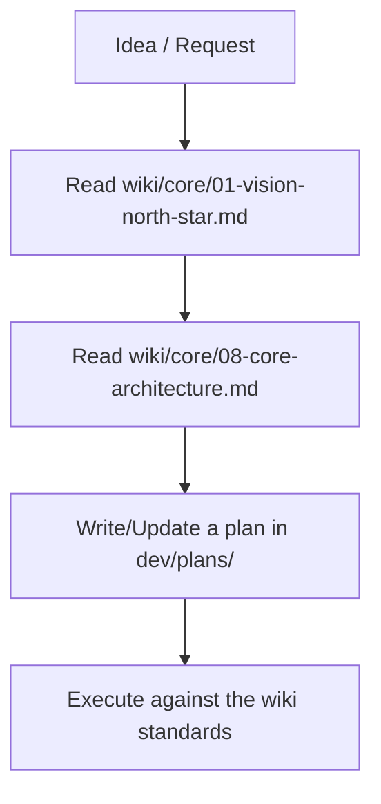
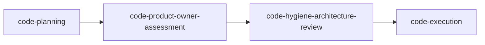
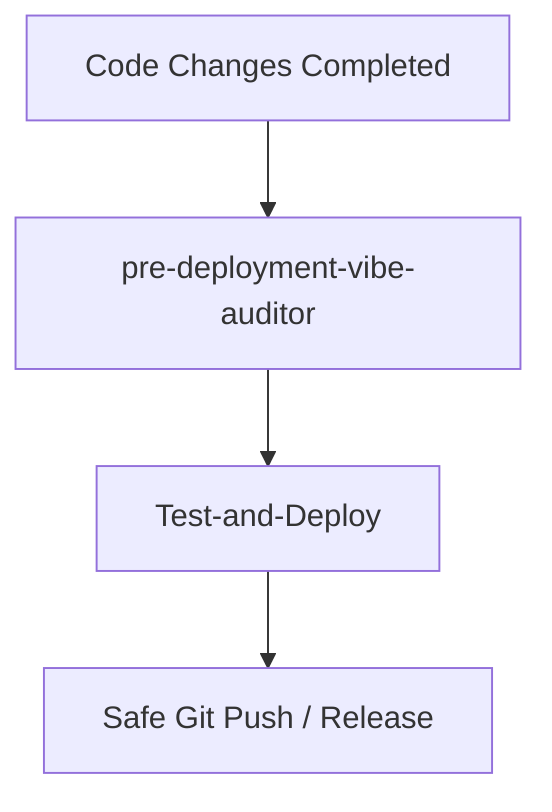

# How-To: Airclone Agentic Development & Documentation Lifecycle

Airclone is built on the **Vibe-App-Wiki** documentation methodology. This guide describes the
workflow for building features and managing documentation in this repository. (The original
app-agnostic skill library is vendored under [`Skills/`](Skills/).)

---

## 1. Bootstrapping & Core Setup

- **Vision:** [`wiki/core/01-vision-north-star.md`](wiki/core/01-vision-north-star.md) — the strategic
  north star. Maintained with the `create-app-vision-north-star` skill.
- **Documentation base:** the `wiki/core/00–18` "brain documents" + `wiki/features|components|logic|database`
  indexes. Maintained with `documentation-architecture-bootstrap` / `-assessment`.

---

## 2. Dual Development Methodologies

### Method A: Pass the Parcel (stateless / planning)
- **Skill:** `pass-the-parcel`
- A single markdown plan file under [`dev/plans/`](dev/plans/) carries all state between stateless
  agent steps. Token-efficient and modular.

### Method B: Multi-Stage Code Pipeline

1. **`code-planning`** — request → detailed implementation plan.
2. **`code-product-owner-assessment`** — audits business logic & edge cases.
3. **`code-hygiene-architecture-review`** — DRY, security, scalable architecture.
4. **`code-execution`** — writes clean, production code and maintains the plan's TODO list.

---

## 3. Airclone-specific guardrails

Because Airclone wraps a powerful engine across very different platforms, a few rules override
generic flow:

- **Spike the unknowns first.** The highest-risk items (in-process `librclone`/gomobile bindings, the
  Android `DocumentsProvider` bridge, desktop FUSE mounting) are validated with throwaway spikes
  before committing to a feature plan. See the [Cross-Platform Architecture plan](dev/plans/).
- **The `RcloneClient` contract is sacred.** Desktop and mobile satisfy the *same* JSON method
  surface (the rclone RC surface). Never branch the UI on platform for engine calls.
- **Every feature is dual-spec'd.** A feature doc in `wiki/features/` must describe desktop *and*
  mobile behavior (or justify a platform exclusion).

---

## 4. Knowledge Retention & Wrap-Up

- **`agent-changelog.md`** — chronological journal of agent work ([`dev/logs/`](dev/logs/)).
- **`knowledge-consolidation` / `knowledge-capture`** — structure and de-duplicate developer
  knowledge into the wiki.
- **`agent-wrap-up`** — final state sync: update logs, sync docs, archive the plan. See the Wrap-Up
  Protocol in [`AGENT.md`](AGENT.md).

---

## 5. Pre-Deployment Validation

- **`pre-deployment-vibe-auditor`** — scans for architectural drift, missing error handling, and
  security risks.
- **`Test-and-Deploy`** — runs tests + linters and verifies config before a safe push/release.
