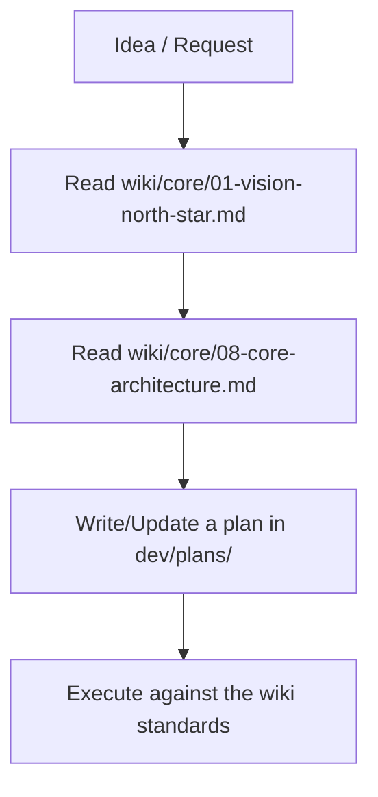
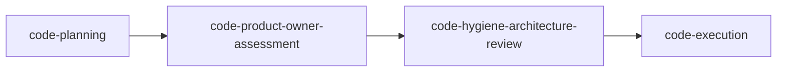
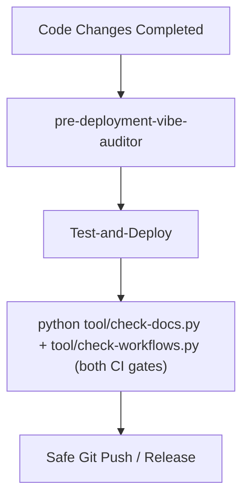

# How-To: Airclone Agentic Development & Documentation Lifecycle

Airclone is built on the **Vibe-App-Wiki** documentation methodology. This guide describes the
workflow for building features and managing documentation in this repository. (The original
app-agnostic skill library is vendored under `Skills/`, which is **gitignored** — it exists on the
machine it was vendored on and is not part of a clone, so do not link to it as a repo path.)

---

## 1. Bootstrapping & Core Setup

```mermaid
graph TD
    A[Idea / Request] --> B[Read wiki/core/01-vision-north-star.md]
    B --> C[Read wiki/core/08-core-architecture.md]
    C --> D[Write/Update a plan in dev/plans/]
    D --> E[Execute against the wiki standards]
```

- **Vision:** [`wiki/core/01-vision-north-star.md`](wiki/core/01-vision-north-star.md) — the strategic
  north star. Maintained with the `create-app-vision-north-star` skill.
- **Documentation base:** the `wiki/core/` "brain documents" — numbered 00–20, with 09 and 13 unused —
  plus the `wiki/features|components|logic|database` indexes. Rather than trust that range, read
  [`wiki/core/00-system-index.md`](wiki/core/00-system-index.md), which enumerates them. Maintained
  with `documentation-architecture-bootstrap` / `-assessment`.

---

## 2. Dual Development Methodologies

### Method A: Pass the Parcel (stateless / planning)
- **Skill:** `pass-the-parcel`
- A single markdown plan file under [`dev/plans/`](dev/plans/) carries all state between stateless
  agent steps. Token-efficient and modular.

### Method B: Multi-Stage Code Pipeline

```mermaid
flowchart LR
    P[code-planning] --> PO[code-product-owner-assessment]
    PO --> H[code-hygiene-architecture-review]
    H --> E[code-execution]
```
1. **`code-planning`** — request → detailed implementation plan.
2. **`code-product-owner-assessment`** — audits business logic & edge cases.
3. **`code-hygiene-architecture-review`** — DRY, security, scalable architecture.
4. **`code-execution`** — writes clean, production code and maintains the plan's TODO list.

---

## 3. Airclone-specific guardrails

Because Airclone wraps a powerful engine across very different platforms, a few rules override
generic flow:

- **Spike the unknowns first.** The highest-risk items (in-process `librclone` over `dart:ffi`,
  shipping the rclone binary as an Android jniLib, desktop FUSE mounting) are validated with throwaway
  spikes before committing to a feature plan. See the
  [Cross-Platform Architecture plan](dev/plans/cross-platform-architecture-plan.md).
- **The `RcloneClient` contract is sacred.** Desktop and mobile satisfy the *same* JSON method
  surface (the rclone RC surface). Never branch the UI on platform for engine calls.
- **Every feature is dual-spec'd.** A feature doc in `wiki/features/` must describe desktop *and*
  mobile behavior (or justify a platform exclusion).

---

## 4. Knowledge Retention & Wrap-Up

- **`agent-changelog.md`** — chronological journal of agent work ([`dev/logs/`](dev/logs/)).
- **`knowledge-consolidation` / `knowledge-capture`** — structure and de-duplicate developer
  knowledge into the wiki.
- **`agent-wrap-up`** — final state sync: update logs, sync docs, archive the plan. See the Wrap-Up
  Protocol in [`AGENT.md`](AGENT.md).

---

## 5. Pre-Deployment Validation

```mermaid
graph TD
    A[Code Changes Completed] --> B[pre-deployment-vibe-auditor]
    B --> C[Test-and-Deploy]
    C --> E["python tool/check-docs.py + tool/check-workflows.py (both CI gates)"]
    E --> D[Safe Git Push / Release]
```

- **`pre-deployment-vibe-auditor`** — scans for architectural drift, missing error handling, and
  security risks.
- **`Test-and-Deploy`** — runs tests + linters and verifies config before a safe push/release.
- **`python tool/check-docs.py`** — the repo's own doc linter, and a **CI gate**: the `docs` job in
  [`.github/workflows/ci.yml`](.github/workflows/ci.yml) runs it on every push to `main` and every
  pull request, so a relative link pointing at a file that no longer exists fails the build instead of
  reaching a reader. Run it locally before you commit docs; **0 broken links** is the bar it enforces.
  It also reports *orphans* (docs nothing links to, so only grep can find them) and `wiki/core/` docs
  missing the shape [`wiki/core/17-docs-blueprint.md`](wiki/core/17-docs-blueprint.md) §3 requires —
  both advisory, and both promoted to failures by `--strict`. Links into `app/` source are checked
  too, so moving a Dart file can break a doc. It hard-fails on one more thing its own docstring does
  not list: a **control byte** in a doc, which makes the file binary to `git diff` and invisible to
  `grep -rn` — write the escape, never the byte.
- **`python tool/check-workflows.py`** — the same `docs` job's third step, and the same shape of gate
  for `.github/workflows/*.yml`: an **empty GitHub expression** (the two braces with nothing between
  them, comments included) invalidates the whole workflow file, and a free-form `workflow_dispatch`
  input interpolated straight into a `run:` block splices a dispatcher's string into the runner's
  shell. GitHub's parser is the only authority on a workflow file and reports a bad one as a logless
  run named after the path, so this runs before the push instead of after it.
- That job also byte-compiles `tool/`, whose store scripts have no tests and whose first execution is
  against a live store API mid-release. None of the three needs Flutter, so they run on a bare Python
  runner and finish in seconds — run all three locally before committing.
