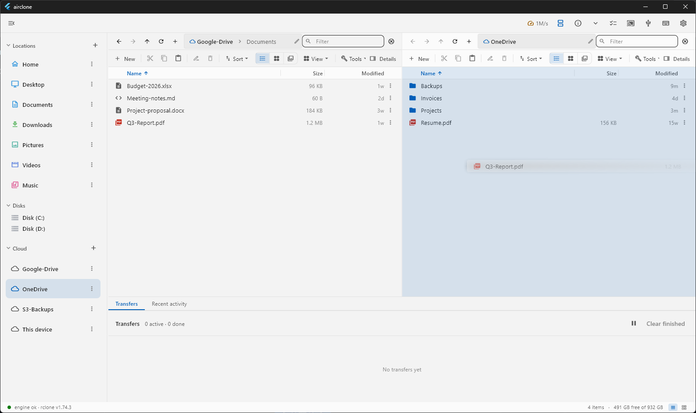
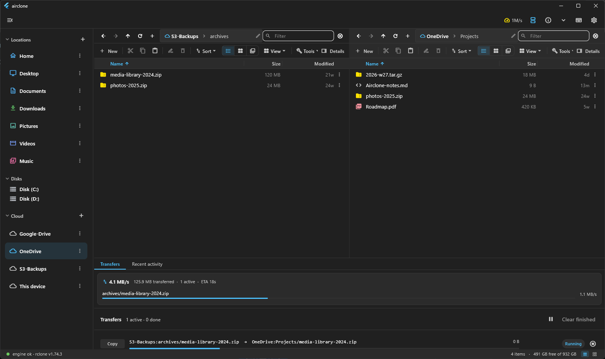
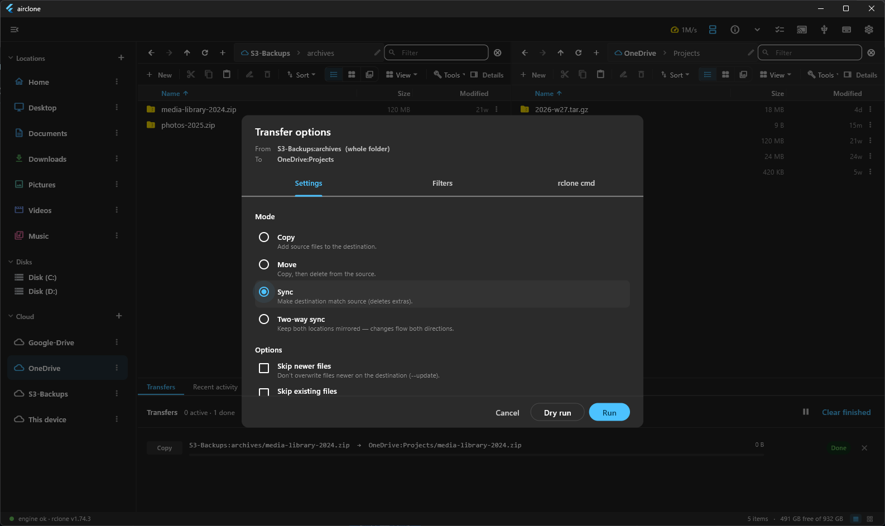
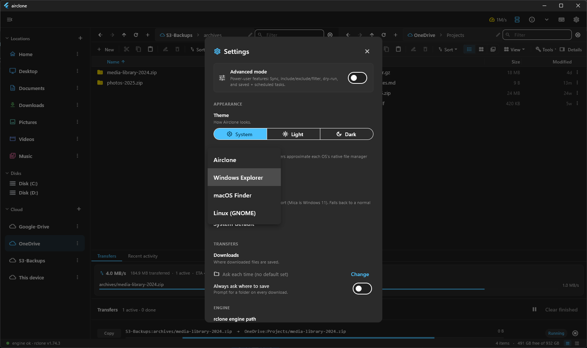
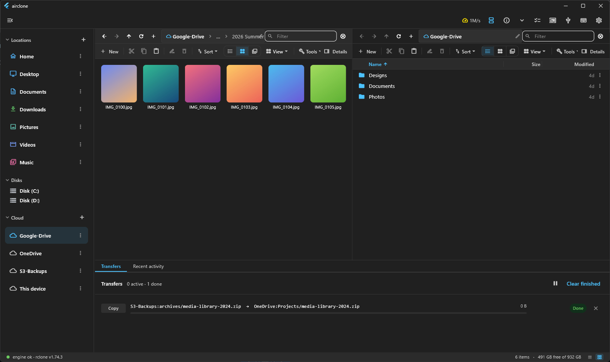
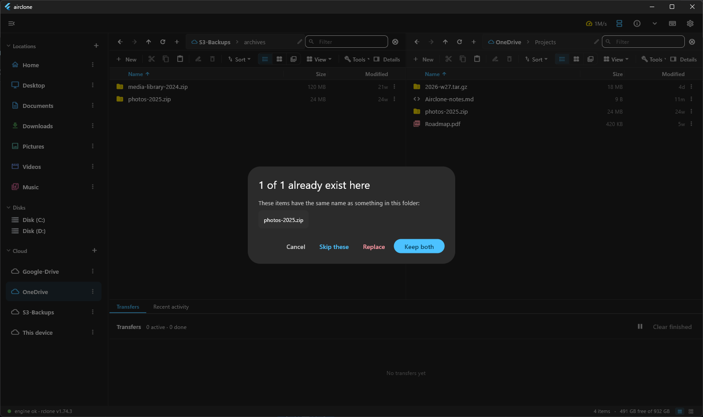
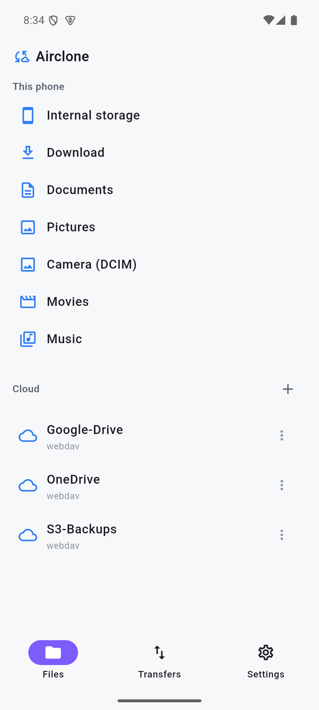
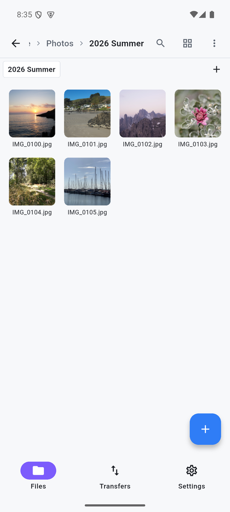

<h1 align="center">Airclone</h1>

<p align="center">
  <b>A modern, intuitive, cross-platform GUI for <a href="https://rclone.org/">rclone</a>.</b><br>
  <i>Make every cloud feel like a local folder — on every device.</i>
</p>

<p align="center">
  <i>Windows · macOS · Linux · Android · iOS — one codebase</i>
</p>

<p align="center">
  <picture>
    <source media="(prefers-color-scheme: dark)" srcset="docs/screenshots/explorer-hero-dark.png">
    
  </picture>
</p>

---

## What is Airclone?

[rclone](https://rclone.org/) is an extraordinarily capable tool for moving files across 70+ cloud
storage systems — but it's a command-line program. **Airclone turns that power into a point-and-click
experience**, and brings it to the desktop *and* the phone:

- 🗂️ **One UI for every backend** — S3, Google Drive, Dropbox, SFTP, WebDAV, local disks… all appear
  as peers in a single list, with the same rows, gestures, and context menu.
- 🖐️ **Direct manipulation** — drag a folder from one cloud to another to copy it; the transfer runs
  as a live job. Easy one-click sync, with dry-run previews before anything destructive.
- ⏰ **Sync & schedule** — Mirror, Backup-new, or Two-way sync; save jobs and run them on a schedule.
- 💽 **Make it local** — mount a remote as a drive on desktop, or flip **"Show in Files"** on mobile
  so the remote appears in your phone's own file explorer and to other apps.
- 🔒 **Free, open-source, and private** — local-only, no telemetry. All manual power stays free.
- 🏢 **Enterprise-ready, without phoning home** — deployable & governable by IT (MDM/policy, enforced
  kill-switches, OS-keychain/Vault secrets, local audit + opt-in SIEM, signed/SBOM'd builds, optional
  self-hosted control plane). Enterprise control flows only through customer-owned channels.

> **Status: beta** — first beta release `v0.1.0-beta.1` (2026-07-09). Windows, macOS, Linux and
> Android builds ship on the [Releases](https://github.com/GigaionLLC/Airclone/releases) page —
> macOS builds are Developer ID **signed + notarized**; iOS hasn't shipped yet. Stack: **Flutter**
> with a single engine abstraction (`rclone rcd` over HTTP on desktop; a bundled rclone engine on
> Android).

## 📸 A tour

<table>
  <tr>
    <td width="50%"><br><sub><b>Live transfers</b> — every copy is an observable job: progress, speed, ETA, pause/cancel.</sub></td>
    <td width="50%"><br><sub><b>Safe sync</b> — Copy / Move / Sync / Two-way, with filters, an rclone-command preview, and one-click <b>dry-run</b>.</sub></td>
  </tr>
  <tr>
    <td><br><sub><b>Native skins + dark mode</b> — Explorer, Finder, or GNOME looks, light and dark.</sub></td>
    <td><br><sub><b>Thumbnails everywhere</b> — image/video previews over any remote, cached encrypted (AES-256-GCM).</sub></td>
  </tr>
  <tr>
    <td colspan="2" align="center"><br><sub><b>Nothing overwrites silently</b> — every collision prompts Skip / Replace / Keep both.</sub></td>
  </tr>
</table>

### 📱 On your phone

<p align="center">
  
  &nbsp;&nbsp;&nbsp;
  
</p>

<p align="center">
  <sub>The full rclone engine ships <b>inside the APK</b> — browse every remote with a touch-first UI,
  run transfers in the background with a live notification, and flip “Show in Files” to expose remotes
  to your phone's own file manager.</sub>
</p>

## 📚 Documentation

This repo follows a structured documentation methodology. **Agents and contributors start at
[`AGENT.md`](AGENT.md).**

| You want to… | Read |
| :--- | :--- |
| Understand the product | [Vision & North Star](wiki/core/01-vision-north-star.md) · [Product Context](wiki/core/02-product-context.md) |
| Understand the architecture | [Core Architecture](wiki/core/08-core-architecture.md) *(framework choice + the `RcloneClient` seam)* |
| Deploy / govern in an org | [Enterprise Readiness](wiki/core/19-enterprise-readiness.md) · [Security](wiki/core/15-security.md) |
| See the layouts | [App Structure & Layouts](wiki/core/05-app-structure.md) *(desktop + mobile wireframes)* |
| Build UI | [Design System](wiki/core/06-design-system.md) · [`DESIGN.md`](DESIGN.md) |
| See the plan | [Feature Backlog](dev/backlog/feature-backlog.md) · [Cross-Platform Plan](dev/plans/cross-platform-architecture-plan.md) |
| Navigate everything | [System Index](wiki/core/00-system-index.md) |

- `wiki/` — long-lived architecture knowledge (the source of truth).
- `dev/` — operational tooling (plans, backlog, logs).
- `Skills/` — the agentic development & documentation skill library.
- `reference/` — **gitignored** competitive research and notes (never committed).

## 🧱 Architecture at a glance

```
UI (Flutter, shared)  →  State (Dart, shared)  →  RcloneClient interface  →  engine
                                                          ├─ desktop: spawn `rclone rcd` + RC HTTP API
                                                          └─ mobile:  in-process librclone (gomobile/FFI)
                                                                       + Android DocumentsProvider / iOS File Provider
```

The whole app talks to one `RcloneClient` interface, so ~95% of the code is platform-agnostic. See
[Core Architecture](wiki/core/08-core-architecture.md).

## 🔧 Building & running

The app lives in [`app/`](app/) (Flutter). This machine builds with **Docker locally** (analyze/test)
and **GitHub Actions for the OS-native binaries**. Desktop builds also need a **Rust toolchain** on
PATH (`super_native_extensions` compiles a crate via cargokit). Full details:
[Directory Structure & Build](wiki/core/04-directory-structure.md).

```powershell
docker compose run --rm flutter flutter analyze   # static analysis
docker compose run --rm flutter flutter test      # unit tests
```

**Downloads:** Windows/macOS/Linux/Android builds are published on the
[Releases](https://github.com/GigaionLLC/Airclone/releases) page (alpha/beta builds are marked
pre-release; macOS builds are signed + notarized). On first launch Airclone downloads + verifies the
rclone engine for you — nothing else to install.

## 💸 Pricing

**Airclone is free.** Every build on the [Releases](https://github.com/GigaionLLC/Airclone/releases)
page is free to download and install (ad-hoc / sideload), and you can always build it from source
yourself — no fees, no feature gates, no accounts.

The one exception: listings on the **Apple App Store, Google Play, and Microsoft Store** will carry a
small fee. That fee exists solely to fund the code-signing certificates and developer-program
memberships those stores require — it buys convenience, not features. The store builds and the free
builds are the same app.

## 🗺️ Roadmap

**Phase 0** spikes → **Phase 1** desktop MVP → **Phase 2** mobile are **shipped**; most of
**Phase 3** advanced (bisync, crypt, scheduling) landed during the alphas — profile sync and iOS are
the big remaining items. Live queue: [Feature Backlog](dev/backlog/feature-backlog.md) · details in
the [Cross-Platform Plan](dev/plans/cross-platform-architecture-plan.md).

## 🤖 Built by AI

Airclone is AI-authored under Gigaion, LLC's direction. Review it with the same judgment you would
apply to any production tool you trust with your files.

> 🥚 *The name is a double wink:* **Airclone** reads as **(AI)rclone** *— an AI‑built companion to
> [rclone](https://rclone.org/) —* and as **air + clone**, *cloning your files through the "air" across
> the clouds rclone reaches.*

## License

Airclone is licensed under the **GNU Affero General Public License v3.0** (AGPLv3) — see
[`LICENSE`](LICENSE). Copyright © 2026 Gigaion, LLC. Built on rclone.
