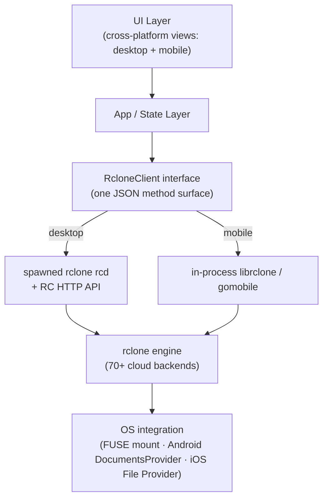

# 🗺️ System Index

Master entry point and directory overview for Airclone's documentation library.

## 📐 Architecture Flow

## 📂 Category Indexes

### 📖 Wiki (Architecture)
- [Features](../features/features-index.md)
- [Components](../components/components-index.md)
- [Logic](../logic/logic-index.md)
- [Database / Persistence](../database/database-index.md)

### ⚙️ dev (Operational)
- [Plans](../../dev/plans/) · [Template](../../dev/plans/template-plan.md)
- [Backlog & Roadmap](../../dev/backlog/backlog-index.md)
- [Plan Archive](../../dev/archive-plans/README.md)
- [Version History](../../dev/logs/version-history.md)
- [Agent Changelog](../../dev/logs/agent-changelog.md)

## 🧠 Core Brain Documents

| File | Purpose |
| :--- | :--- |
| [00-system-index.md](00-system-index.md) | Master router and architecture flow. |
| [01-vision-north-star.md](01-vision-north-star.md) | Strategic vision, value proposition, magic moment. |
| [02-product-context.md](02-product-context.md) | Personas, domain workflows, competitive landscape, roadmap. |
| [03-user-journey.md](03-user-journey.md) | Per-platform UI tour (Win/macOS/Linux/Android/iOS) with wireframes + feature matrix. |
| [04-directory-structure.md](04-directory-structure.md) | Physical folder map and location rules. |
| [05-app-structure.md](05-app-structure.md) | App shell, navigation, layouts, global wrappers. |
| [06-design-system.md](06-design-system.md) | Color tokens, typography, spacing, components. |
| [07-state-context.md](07-state-context.md) | Stores, global context, data models. |
| [08-core-architecture.md](08-core-architecture.md) | **The rclone engine integration & cross-platform architecture (most important doc).** |
| [09-ai-features.md](09-ai-features.md) | (Reserved) any in-app AI features. |
| [10-external-integrations.md](10-external-integrations.md) | rclone backends, OAuth, FUSE/SAF/File Provider, OS integrations. |
| [11-validation-standards.md](11-validation-standards.md) | Input/config validation tiers and error hierarchy. |
| [12-utility-standards.md](12-utility-standards.md) | Formatters (bytes, rates, durations), precision rules. |
| [13-theme-linguistics.md](13-theme-linguistics.md) | Localization keys, naming, nomenclature. |
| [14-performance-standards.md](14-performance-standards.md) | Performance budgets, virtualization, lazy loading. |
| [15-security.md](15-security.md) | Secrets, RC auth, config encryption, agent governance. |
| [16-glossary-of-terms.md](16-glossary-of-terms.md) | Canonical dictionary (remote, backend, mount, bisync, …). |
| [17-docs-blueprint.md](17-docs-blueprint.md) | The documentation architecture standard. |
| [18-knowledge-capture.md](18-knowledge-capture.md) | Decision logs and rationale. |
| [19-enterprise-readiness.md](19-enterprise-readiness.md) | Enterprise: deployment/MDM, identity, secrets, audit, governance, supply chain, headless ops — without phoning home. |
| [20-explorer-design.md](20-explorer-design.md) | Explorer direction: principles, layout (top bar/sidebar/inspector/status), view modes, thumbnails + Quick Look over rclone, native feel, phased plan. |
