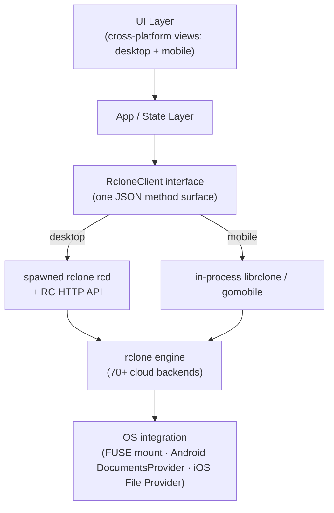

# 🗺️ System Index

Master entry point and directory overview for Airclone's documentation library.

**When to read this:** you have just been pointed at this repository, or you know the task but not
which document owns it, and you need the one file to open next rather than a folder to browse.

## 📐 Architecture Flow

```mermaid
graph TD
    UI["UI Layer<br/>(cross-platform views: desktop + mobile)"] --> State["App / State Layer"]
    State --> RC["RcloneClient interface<br/>(one JSON method surface)"]
    RC -->|desktop| RCD["spawned rclone rcd<br/>+ RC HTTP API"]
    RC -->|mobile| LIB["in-process librclone / gomobile"]
    RCD --> ENG["rclone engine<br/>(70+ cloud backends)"]
    LIB --> ENG
    ENG --> OS["OS integration<br/>(FUSE mount · Android DocumentsProvider · iOS File Provider)"]
```

The seam in the middle — one `RcloneClient` interface, two transports — is the load-bearing decision
of the whole project: [08-core-architecture.md](08-core-architecture.md).

## 📂 Category Indexes

### 📖 Wiki (Architecture — how the code works)

| Index | Covers |
| :--- | :--- |
| [Features](../features/features-index.md) | Per-screen / per-capability specs (file browser, sync, mount, preview…). |
| [Components](../components/components-index.md) | Reusable UI primitives built from the design-system tokens. |
| [Logic](../logic/logic-index.md) | Non-UI modules: the rclone control layer and shared utilities. |
| [Database / Persistence](../database/database-index.md) | What Airclone stores locally (`rclone.conf` is owned by the engine). |

### ⚙️ dev (Operational — how work gets planned, built, released)

| Entry | Covers |
| :--- | :--- |
| **[dev hub](../../dev/README.md)** | **Start here for anything operational** — release checklist, signing, store submission, native/engine builds, the directory map of `dev/`. |
| [Plans](../../dev/plans/) · [Template](../../dev/plans/template-plan.md) | Active multi-step work; every non-trivial task gets a plan. |
| [Backlog & Roadmap](../../dev/backlog/backlog-index.md) | The queue and the prioritised roadmap. |
| [Plan Archive](../../dev/archive-plans/README.md) | Where finished plans are moved on wrap-up. |
| [Version History](../../dev/logs/version-history.md) | Per-version record of what shipped. |
| [Agent Changelog](../../dev/logs/agent-changelog.md) | Append-only audit log; read the last 3 entries before writing code. |

### 🏪 docs (Public-facing / store)

| Entry | Covers |
| :--- | :--- |
| **[Store submissions index](../../docs/store/README.md)** | Per-store status, listing copy, assets, pricing policy, pre-submission audit. |

## 🧠 Core Brain Documents

| File | Purpose |
| :--- | :--- |
| [00-system-index.md](00-system-index.md) | Master router and architecture flow. |
| [01-vision-north-star.md](01-vision-north-star.md) | Strategic vision, value proposition, magic moment. |
| [02-product-context.md](02-product-context.md) | Personas, domain workflows, competitive landscape, roadmap. |
| [03-user-journey.md](03-user-journey.md) | Per-platform UI tour (Win/macOS/Linux/Android/iOS) with wireframes + feature matrix. |
| [04-directory-structure.md](04-directory-structure.md) | Physical folder map and location rules. |
| [05-app-structure.md](05-app-structure.md) | App shell, navigation, layouts, global wrappers. |
| [06-design-system.md](06-design-system.md) | Color tokens, typography, spacing, components. |
| [07-state-context.md](07-state-context.md) | The Riverpod provider graph: which provider owns which state, where it lives, what mutates it, what it persists, and the lifecycle traps. |
| [08-core-architecture.md](08-core-architecture.md) | **The rclone engine integration & cross-platform architecture (most important doc).** |
| [10-external-integrations.md](10-external-integrations.md) | Every seam between Airclone and the outside world: the `RcloneClient` engine abstraction, the rclone RC method catalogue, the platform channel, bundled native code, and the OS integration surfaces. |
| [11-validation-standards.md](11-validation-standards.md) | Where Airclone validates input, how destructive actions are gated, and the fixed hierarchy by which a failure reaches the user. |
| [12-utility-standards.md](12-utility-standards.md) | Inventory of the shared formatters, path helpers and small pure functions that already exist, with their precision rules — so agents reuse rather than reinvent. |
| [14-performance-standards.md](14-performance-standards.md) | The concurrency budgets, content-read guards, and lifecycle invariants that broke real releases when violated — each with the failure it prevents and how to check you have not broken it. |
| [15-security.md](15-security.md) | Secrets, RC auth, config encryption, agent governance. |
| [16-glossary-of-terms.md](16-glossary-of-terms.md) | Canonical dictionary (remote, backend, mount, bisync, …). |
| [17-docs-blueprint.md](17-docs-blueprint.md) | The documentation architecture standard: which tree a doc belongs in, the shape every doc must have, and how to register a new one so it is reachable. |
| [18-knowledge-capture.md](18-knowledge-capture.md) | Where a hard-won fact goes so it survives: release note vs agent changelog vs plan vs durable invariant vs process runbook, with a decision table. |
| [19-enterprise-readiness.md](19-enterprise-readiness.md) | Enterprise: deployment/MDM, identity, secrets, audit, governance, supply chain, headless ops — without phoning home. |
| [20-explorer-design.md](20-explorer-design.md) | Explorer direction: principles, layout (top bar/sidebar/inspector/status), view modes, thumbnails + Quick Look over rclone, native feel, phased plan. |

**Numbers `09` and `13` are intentionally unused — nothing is missing.** `09` was reserved for in-app
AI features (Airclone ships none) and `13` for localisation/linguistics (the app is single-locale
English today). Do not recycle either number; if the topic becomes real, revive that same number. The
rule and the evidence behind it are in [17-docs-blueprint.md](17-docs-blueprint.md) §2, which also
records the next free number.

## 🚪 Other entry points

| File | Purpose |
| :--- | :--- |
| [AGENT.md](../../AGENT.md) | Agent entry point: mandatory reading order, Task Lookup table, core rules, wrap-up protocol. |
| [README.md](../../README.md) | Public project README. |
| [DESIGN.md](../../DESIGN.md) | Visual/brand reference that accompanies [06-design-system.md](06-design-system.md). |
| [HOW-TO.md](../../HOW-TO.md) | End-user guide. |

## Related

[Core Architecture](08-core-architecture.md) · [Docs Blueprint](17-docs-blueprint.md) ·
[Knowledge Capture](18-knowledge-capture.md) · [dev hub](../../dev/README.md) ·
[Store submissions](../../docs/store/README.md) · [AGENT.md](../../AGENT.md)
