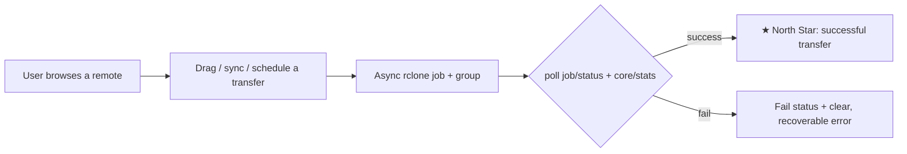

# 🎯 Vision & North Star

Airclone is a modern, intuitive, **cross-platform** GUI for [rclone](https://rclone.org/) — desktop
(Windows / macOS / Linux) **and** mobile (Android / iOS) from one codebase. It turns rclone's power —
70+ cloud backends, copy/move/sync, mount, encryption, public links — into a point-and-click
experience, and makes a cloud remote feel like a folder on your own device.

## 👁️ Vision Statement

> **Make every cloud feel like a local folder — on every device.**

Anyone should be able to *browse, organize, and move files across their cloud storages effortlessly*
without touching a command line, a config file, or an HTTP API — whether they're at a desktop or on
their phone.

Four pillars carry the vision:

| Pillar | What it means |
| :--- | :--- |
| **One UI for every backend** | Any rclone remote (S3, Drive, Dropbox, SFTP, WebDAV, …) plus local disks appear as peers in a single list, with the same rows, gestures, and context menu. No "cloud mode" vs "local mode." |
| **A rebuilt explorer, not a mount** | The hero is an in-app file explorer purpose-built for rclone — open many remotes at once (tabs + dual-pane), configure them inline, and drag files **onto folders** like a native explorer. It transfers via rclone directly (server-side moves, no VFS), so it's faster than working on a mounted drive. |
| **Direct manipulation** | The primary verbs — copy, move, sync — are things you *do* with your hands (drag between panes or onto a folder), not forms you fill out. Dialogs exist for precision, not for basics. |
| **Local when you want it** | A remote can *also* be reached from the OS file explorer — mounted as a drive (desktop) or shown in the system Files app (mobile, Android/iOS) — as a convenience for other apps. This is secondary to the in-app explorer, which stays the fast path for uploading and moving. |
| **Safe by default, powerful on demand** | Destructive operations always offer a dry-run preview and a color-coded diff before touching data; every advanced rclone control is one disclosure away, never in your face. |

## 🌟 North Star Metric

> **Successful cross-storage transfers completed per active user per week.**

Moving bytes between two storages — or making a remote materialize as a drive / in the Files app — is
the one thing the CLI makes hard and Airclone makes easy. Every transfer is a `Job` with a type
(`Copy`/`Move`/`Sync`) and a terminal status; a "successful transfer" is simply `status == success`.
Airclone ships **no telemetry** — this metric is a product-design compass, not a surveillance target.

## 🗺️ Product Framing & Competitive Positioning

### Problem

rclone is extraordinarily capable but is a **command-line program**. To use it a person must
hand-author a config of remotes, remember backend-prefixed paths and flag-heavy commands, reason
about async transfers in a terminal, and separately wire up FUSE drivers to mount remotes. This
excludes non-technical users entirely and slows down even power users for everyday browse-and-move
tasks — and it offers nothing at all on a phone.

### Solution

Airclone keeps rclone as the engine but replaces the operator surface with a modern GUI, driving the
*same* rclone control API from a single abstraction (HTTP to a spawned daemon on desktop; the rclone
library in-process on mobile). One config, one capability set, two form factors. See
[08-core-architecture.md](08-core-architecture.md).

### Positioning

| Alternative (category) | Where Airclone differentiates |
| :--- | :--- |
| **The rclone CLI** | Airclone *is* rclone, with a GUI: browse, preview, drag-to-transfer, a job manager, and config forms generated from `config/providers`. Same config, same backends. |
| **Older third-party desktop GUIs** | Airclone is a modern, themeable, **cross-platform incl. mobile** app on a real design system, driving the long-lived RC surface (structured jobs/stats) instead of spawning a process per command. |
| **Single-vendor web consoles** (Drive/Dropbox/S3) | Airclone is **provider-agnostic and cross-storage**: one window lists every remote plus local disks, and a transfer can cross provider boundaries (Drive → S3) as one job. |
| **Commercial, paywalled mount/sync clients** | Airclone is **free and open-source**, keeps all *manual* power free, and is the only option that ships a polished mobile app where remotes appear in the system Files UI. |

> **Also enterprise-ready — without phoning home.** Airclone is deployable and governable by IT
> (MDM/policy, enforced kill-switches, OS-keychain/Vault secrets, local audit + opt-in SIEM, signed
> builds) while staying local-first with **no telemetry and no Airclone-operated cloud**. Enterprise
> control flows only through customer-owned channels. See
> [Enterprise Readiness](19-enterprise-readiness.md).

## ⚡ The Magic Moment

> **The first time a user drags a file out of one cloud and into another — or flips "Show in Files"
> on their phone and watches a remote appear inside the system file explorer — without ever opening a
> terminal.**

That instant — bytes moving between two clouds from one window, or a cloud becoming a place your phone
and its apps can browse — is when the user realizes Airclone has turned rclone's power into something
they can simply *use*.

---

**Related:** [Product Context](02-product-context.md) · [Core Architecture](08-core-architecture.md) ·
[Design System](06-design-system.md) · [Feature Backlog](../../dev/backlog/feature-backlog.md)
