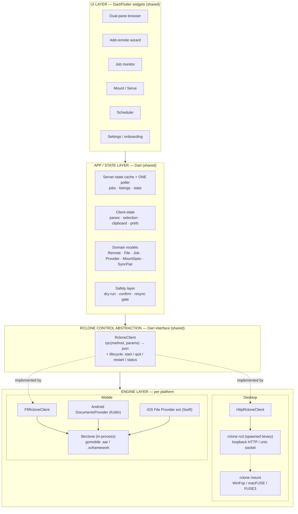

# 🧱 Core Architecture

This is the most important document in the repository. Airclone wraps a powerful engine (rclone)
across five operating systems. Two decisions make that tractable:

1. **One UI codebase** for desktop and mobile.
2. **One engine abstraction** — the `RcloneClient` interface — behind which the engine is driven
   differently per platform, while the entire app above it stays platform-agnostic.

> Read this before writing anything that talks to rclone or branches on platform.

---

## 1. Framework Decision

### Primary: **Flutter (Dart)**

Flutter is the only option that satisfies **every** hard requirement — Windows, macOS, Linux desktop
**and** Android + iOS mobile — from one codebase, with proven prior art for *this exact app class*
(a cross-platform app that embeds the rclone library in-process on mobile and ships a polished
Files-app integration).

| Requirement | How Flutter satisfies it |
| :--- | :--- |
| One codebase: Win + macOS + **Linux** desktop | All three are stable, GA targets (Linux is first-class — a gap for some competitors). |
| Android **and** iOS mobile | Flutter's home turf; best-in-class. |
| Embed `librclone` in-process on mobile | `dart:ffi` → C `librclone`, or a gomobile `.aar`/`.xcframework` via a thin platform channel. |
| Drive `rclone rcd` over HTTP on desktop | Trivial: `Process` spawns the bundled binary, `http` POSTs JSON. |
| Drag-and-drop, in **and out** | `super_drag_and_drop` (Rust-backed, real OS payloads) + `desktop_drop`. |
| System tray + quick actions | `tray_manager`. |
| Desktop FUSE mount | Spawn the bundled `rclone mount` against WinFsp/macFUSE/FUSE3 — no framework limit. |
| Android `DocumentsProvider` / iOS File Provider | Native Kotlin/Swift host code calling the same in-process engine. |

**The decisive point:** the storage-bridge layers that make a remote *appear in the system Files
app* **must be native per platform regardless of framework** — a Kotlin `DocumentsProvider` on
Android, a Swift `NSFileProviderReplicatedExtension` on iOS. No framework abstracts these away.
Flutter therefore loses nothing there that any competitor would keep, while winning on Linux desktop,
mobile maturity, drag-out support, and bundle size.

**Language posture:** Dart for ~95% of the app (UI, state, the `RcloneClient` abstraction);
Kotlin + Swift only for the unavoidable native storage bridges and background services; Go (vendored,
pinned) only as the build-time source of the `librclone` artifacts.

### Runner-up: **Tauri 2 (Rust core + web frontend)**

Tauri 2 is the documented fallback and the better choice **if Airclone's center of gravity shifts to
desktop-first with mobile deferred** — it has the smallest binaries (OS WebView, no bundled Chromium)
and a web frontend many developers already know. Its weakness is precisely mobile: less proven, and
the hardest mobile features (`DocumentsProvider` + foreground sync) get **no framework help** — you'd
hand-write the same Kotlin/Swift as under Flutter, on a less-proven mobile shell.

**We would switch to Tauri 2 if:** the iOS in-process-engine path proves blocking in the Phase 0
spike (low probability — prior art exists), desktop "native file-manager polish" becomes the dominant
driver with mobile shelved, or the team's velocity strongly favors TypeScript/Rust over Dart.

**Rejected:** .NET MAUI (no official Linux desktop — disqualifying), React Native (no Linux desktop;
weak desktop drag-and-drop), Electron + Capacitor (two native shells = two integration codebases +
Chromium bloat), Kotlin/Compose Multiplatform (cleanest mobile-engine alignment but weakest desktop
tray/drag-drop tooling and experimental iOS FFI today — honorable mention).

---

## 2. Layered Architecture

Four strictly-ordered layers. The **`RcloneClient`** interface (§3) is the load-bearing seam:
everything above it is platform-agnostic Dart; everything below it is per-platform transport + native
bridges.



- **UI layer (shared Dart):** pure presentation + gestures. Knows nothing about transports.
- **App/state layer (shared Dart):** *server-state* (listings, job status, stats — cached & polled)
  and *client-state* (active panes, selection, clipboard, view prefs); typed domain models; the
  provider-form engine; the safety layer (dry-run, destructive-action confirmation, bisync gating).
- **Control abstraction (shared Dart):** the `RcloneClient` interface — one `rpc()` method + an
  engine-lifecycle contract. The entire surface the upper layers depend on.
- **Engine layer (per platform):** two concrete `RcloneClient` implementations plus the native
  storage bridges, which call the same engine core (shared config + cache).

---

## 3. The Key Decision — rclone Engine Integration Per Platform

rclone exposes exactly **one control surface**: the Remote Control (RC) API — JSON-in/JSON-out
methods named `category/method` (`sync/copy`, `operations/list`, `config/providers`, `job/status`,
`mount/mount`). Crucially, **the identical method/params surface is available whether driven over
HTTP or in-process.** This is the foundation of Airclone's portability.

| Platform | Strategy | Mechanism | Rationale |
| :--- | :--- | :--- | :--- |
| **Win / macOS / Linux desktop** | Spawn `rclone rcd`, drive over HTTP | Bundled binary; `rcd` on loopback + unix socket/named pipe; POST JSON | Crash isolation (daemon crash ≠ app crash); **swap the binary to upgrade rclone independently**; real FUSE mounts need the binary anyway; the most mature path. |
| **Android** | Embed `librclone` in-process | `librclone.aar` via `gomobile bind -target=android`; call `RcloneRPC(method, json)` over FFI/platform-channel | No reliable subprocess model (background limits, W^X). In-process runs under the app's own lifecycle, which Android schedules predictably. |
| **iOS** | Embed `librclone` — the **only** option | `rclone.xcframework` via `gomobile bind -target=ios`; call in-process | iOS forbids `fork()`/`exec()` of bundled binaries. Linking the library is the only legal way to run rclone on iOS. |
| **Desktop (future option)** | librclone in-process | `dart:ffi` → `librclone.{so,dll,dylib}` | Reserved for a single-process desktop variant. **Not the default** — we keep the spawnable binary on desktop. |

### The single internal interface

Both transports satisfy this one Dart interface. **The UI/state layers depend only on this; they
never know which transport is live.**

```dart
/// The ONE seam. `method` == an rclone RC method string ("sync/copy", etc.).
/// params/return are the identical JSON shapes for HTTP and librclone.
abstract interface class RcloneClient {
  Future<Map<String, dynamic>> rpc(String method, Map<String, dynamic> params);

  Future<void> start();            // desktop: spawn rcd & await core/version; mobile: RcloneInitialize()
  Future<void> quit();             // desktop: core/quit then kill; mobile: RcloneFinalize()
  Future<void> restart();          // FIRST-CLASS op (see §3.2) — rclone has no core/restart
  Future<EngineStatus> status();   // running / paused(reason) / dead; min-version check

  /// Streaming binary read (media/thumbnails).
  /// Desktop: HTTP --rc-serve URL. Mobile: VFS-cache-backed file / pipe. Same call shape.
  Future<Stream<List<int>>> openObject(String fs, String remote);
}

enum PauseReason { password, path, version, updating }
```

- **`HttpRcloneClient`** — spawns `rclone rcd --rc-addr=127.0.0.1:<random> --rc-user=<id>
  --rc-pass=<secret>` (prefer unix socket / named pipe), injects Basic auth, POSTs `rpc()` to
  `http://<addr>/<method>`.
- **`FfiRcloneClient`** — calls `RcloneInitialize()` once, marshals `rpc()` to
  `RcloneRPC(method, inputJSON) → (outputJSON, status)` on a background isolate (calls block), frees
  output with `RcloneFreeString`.

Because the JSON surface is byte-for-byte identical, **~95% of Airclone is transport-agnostic** and
written once.

### 3.1 librclone constraints to design around

- **`operations/uploadfile` and `core/command` are NOT available in librclone** (they need raw HTTP
  request/response objects). On mobile, do uploads via `operations/copyfile` / `sync/copy` from a
  local path; never call `core/command`.
- **No crash isolation in-process:** a fatal in rclone takes the app down. Validate inputs, structure
  RPC errors, pin a known-good rclone tag.
- **Cannot hot-swap** the embedded library — the rclone version is baked into the app release. Pin it;
  bake the upgrade path into release engineering.

### 3.2 RC limitations that force a first-class engine **restart**

Treat **engine restart** as a core, well-tested operation. These all require a restart or out-of-band
handling:

1. **Cache/temp path changes** — `config/setpath` only sets `path`; `CacheDir` desyncs. ⇒ restart.
2. **No safe "is config encrypted?" check** — `config/get` *hangs* on a locked config. ⇒ detect
   encryption **out-of-band before any RC call**.
3. **Locked-config deadlock** — a locked encrypted config blocks rclone on stdin and freezes the RC
   server. **`--ask-password=false` is NOT a workaround** (it crashes rclone). ⇒ gate startup behind
   a password check; feed `RCLONE_CONFIG_PASS` via env; never use `--ask-password=false`.
4. **No `core/restart`** (only `core/quit`) ⇒ Airclone implements restart (quit + respawn on desktop;
   Finalize + Initialize on mobile).
5. **Global flags & VFS filters are captured at startup** ⇒ persistent per-mount filters need startup
   flags / a dedicated engine instance, not a per-call `_filter`.
6. **No RC self-update** ⇒ Airclone does its own download + SHA256-verify + swap (desktop) / ships a
   new build (mobile).

See [10-external-integrations.md](10-external-integrations.md) for the full RC surface map, and
[`wiki/logic/util-rclone-client.md`](../logic/logic-index.md) for the transport implementations.

---

## 4. Two ways to touch files: in-app explorer (primary) vs OS mount (convenience)

Airclone gives a remote two faces. **Know which is the performant path:**

| | **In-app file explorer** (primary) | **OS mount / system Files** (convenience) |
| :--- | :--- | :--- |
| How it transfers | Direct RC calls: `operations/copyfile`/`movefile` (**server-side** within a remote — bytes never leave the cloud), streamed `sync/copy` across remotes, `operations/uploadfile`/local-path for OS↔remote | Kernel/FUSE or SAF I/O through the **VFS cache** (write-back, chunking, cache eviction) |
| Upload / move performance | Fast — no VFS round-trip; same-remote moves are instant server-side ops | Slower — uploads and moves stage through the VFS cache before commit |
| Where it works | Inside Airclone's UI (drag-and-drop, multi-select, jobs) | Inside *any other app* (Office, editors, the OS file picker) |
| Role | **The hero surface** — everyday browse/transfer/sync | A bridge so a remote is reachable outside Airclone |

**Design rule:** route everyday file work through the in-app explorer; offer mount/system-Files for
interop with other apps, and surface its VFS trade-off honestly. The in-app transfer engine
(stat-then-dispatch, server-side where possible, single shared job poller) is specified in
[05-app-structure.md](05-app-structure.md) and the file-browser feature doc.

### Making a remote "appear in the OS file explorer" — native per platform

**There is no cross-platform shortcut.** The Flutter UI manages it; the bridge is platform code
calling the same engine core.

| Platform | Mechanism | Engine | Native code |
| :--- | :--- | :--- | :--- |
| **Windows** | FUSE mount as drive letter via **WinFsp** (`--network-mode` for Explorer stability) | spawned `rclone mount` | Detect/install WinFsp |
| **macOS** | FUSE mount at `/Volumes/<name>` via **macFUSE** or **FUSE-T** (no-kext) | spawned `rclone mount` | Detect/install driver |
| **Linux** | FUSE3 mount via `fusermount3` | spawned `rclone mount` | Mind AppArmor (recent Ubuntu) |
| **Android** | **`DocumentsProvider` (SAF)** → remote appears in system Files & to any SAF-aware app | **in-process librclone** + VFS cache | **Yes — Kotlin** |
| **iOS / iPadOS** | **`NSFileProviderReplicatedExtension`** → appears in Files | **in-process librclone** in the extension | **Yes — Swift** |

**Android is not a real FUSE mount** — that needs root (`/dev/fuse` is SELinux-blocked for ~99% of
users). The correct bridge is a custom `DocumentsProvider`: implement `queryRoots` (one row per
remote — **must be instant**, return cached remotes synchronously), `queryChildDocuments`
(`operations/list`), `queryDocument` (stat), `openDocument` (`ParcelFileDescriptor`). Random access
needs the VFS cache on local disk; writes are *download-modify-reupload on close*, run off the binder
thread.

**iOS** uses a separate File Provider extension target sharing config/cache with the host app via an
**App Group**. Hard constraints: ~**20 MB** extension memory cap (never load whole media — stream to
disk in bounded chunks) and **no true streaming through Files** (whole-file up/down, like iCloud
Drive). For real range playback, expose a separate in-app `rclone rcd` HTTP server with range headers.

Desktop mount must **auto-detect and offer to install** the FUSE provider (via `mount/types`) and
expose a full VFS options panel (cache mode default `writes`, cache size/age, read-only, volume name).

---

## 5. State, Config & Secrets (summary)

Full detail in [07-state-context.md](07-state-context.md) and [15-security.md](15-security.md).

- **Two state categories:** *server-state* (listings/jobs/stats — cached, deduped, polled by **one
  shared ~1 Hz poller** keyed by `_group`) and *client-state* (panes, selection, clipboard, prefs).
- **`rclone.conf` is owned entirely by the engine** — Airclone never reads/writes it directly; all
  mutation via `config/*`. Credentials live there, never in app stores.
- **App settings & layout** in a small typed local store (window bounds, pane weights, theme, mount
  registry, scheduler jobs).
- **Secrets:** detect config encryption out-of-band; gate startup behind a password prompt; export
  `RCLONE_CONFIG_PASS` to the engine (never persist it); OS-keychain opt-in; transient random RC
  credentials per desktop session, loopback only (prefer unix socket/named pipe). In-process mobile
  librclone has **no network attack surface**.
- **Dynamic remote forms** are generated from cached `config/providers` (Type→widget mapping,
  `Examples`/`Exclusive`, `Provider` conditionals, Advanced expander, `IsPassword`/`Sensitive`), and
  the **interactive/OAuth state machine** drives `config/create`/`update` with
  `opt.nonInteractive` + `continue`/`state`/`result`.

---

## 6. Build Roadmap (pointer)

The phased plan (Phase 0 spike → Phase 1 desktop MVP → Phase 2 mobile → Phase 3 advanced) and the
full risk register live in the active plan:
**[dev/plans/cross-platform-architecture-plan.md](../../dev/plans/cross-platform-architecture-plan.md)**.

The four highest-risk unknowns — all engine/platform-seam, not UI — are spiked **first**: iOS
`librclone` xcframework, the dual-transport `RcloneClient`, the Android `DocumentsProvider` bridge,
and first-class engine restart + out-of-band encryption detection.

---

**Related:** [Vision & North Star](01-vision-north-star.md) · [State & Context](07-state-context.md) ·
[External Integrations](10-external-integrations.md) · [Security](15-security.md) ·
[Cross-Platform Plan](../../dev/plans/cross-platform-architecture-plan.md)
