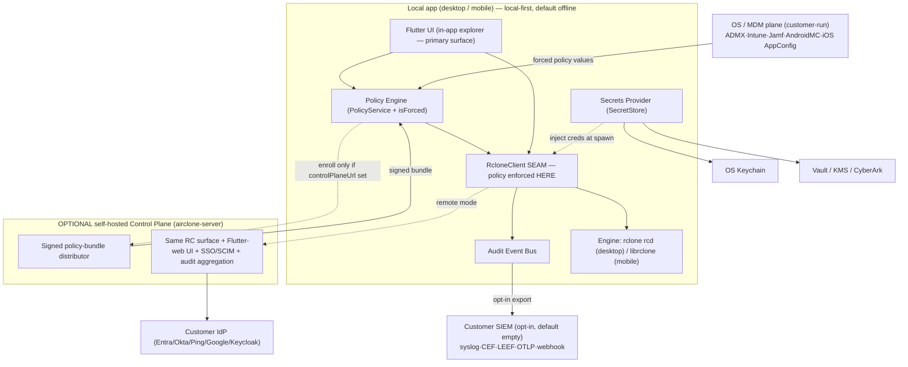

# 🏢 Enterprise Readiness

Airclone is built to be **enterprise-ready without betraying its privacy-first DNA.** The apparent
contradiction — *"local-first, no phone-home"* vs *"enterprises want central control, audit, and fleet
management"* — dissolves once you separate **whether a control plane exists** from **who operates it.**
In Airclone, **the customer owns every control surface.** There is no Airclone-operated cloud, no
default outbound connection to Airclone infrastructure, and no mandatory account. Enterprise control
arrives through three **customer-controlled** channels:

1. The **OS/MDM management plane** the org already runs (ADMX/GPO, Intune, Jamf, Android managed
   config, iOS AppConfig) carrying signed **policy**.
2. An **optional, self-hosted control plane** the customer deploys, which the local app **enrolls into
   only when an admin supplies its URL**.
3. **Opt-in, on-prem audit/telemetry sinks** (the customer's own syslog/OTLP/SIEM) that **default to
   empty**, so egress is zero unless IT configures it.

The out-of-box experience for an individual stays fully offline — no login, no telemetry, a local
encrypted config — and **must never regress.** Enterprise features *activate on top of it*; they never
*replace* it.

## 🧭 Principles

- **Local-first is the immovable default.** No login, no control plane, no telemetry out of the box.
  This is the brand; it is never paywalled and never regressed.
- **Customer owns the control plane.** Fleet management, audit aggregation, and SSO target endpoints
  the *customer* operates. Airclone ships no default remote endpoint.
- **Opt-in egress only.** Update checks, crash reports, telemetry, and audit forwarding are
  default-OFF and point only at customer-configured destinations. Empty config ⇒ zero egress (a CI
  test asserts this).
- **MDM + policy files are the baseline; a server is the upgrade.** ~80% of "central management" value
  (kill-switches, allow/deny lists, forced encryption, pre-provisioned remotes) ships via OS-native
  managed config with **no server at all**.
- **Federate identity, never own it.** Airclone is an OIDC *relying party* to the customer's IdP
  (Entra ID / Okta / Ping / Google / Keycloak). It is never an IdP and never holds the user's primary
  credential.
- **Secrets stay with the customer.** Credentials resolve from the OS keystore, the customer's
  Vault/KMS, or a device-key-released bundle. Airclone servers never see plaintext secrets.
- **Never SSO-tax core safety.** SSO/MFA login, local encryption, on-device audit, and MDM
  manageability are **free** in the OSS client. The paid line is fleet scale + observability export +
  assurance — never per-user security.
- **Enforce, don't just hide.** Policy kill-switches are enforced **at the `RcloneClient` seam**
  (refusing the RC/librclone call), not merely greyed out — so a power user can't bypass via shell.
- **Honest guardrails.** Airclone is a strong guardrail for cooperative users plus an audit trail for
  everyone — *not* an unbypassable DLP appliance against a determined local admin who can run `rclone`
  directly. We state this boundary plainly.

---

## 1. Enterprise Maturity Model

| Dimension | Table-stakes (v1-ent) | Differentiator | Scope |
| :--- | :--- | :--- | :--- |
| **Deployment / MDM** | One canonical policy schema → ADMX+GPO, Intune, Jamf `.mobileconfig`, `/etc/airclone/policy.json`, Android `app_restrictions.xml`, iOS AppConfig. Signed installers/repos. Forced keys lock/hide. | Mandatory-vs-recommended dual tier; pre-provisioned remotes pushed by policy; ready-made PPPC + system-extension + AppConfig snippets. | all |
| **Identity / SSO / SCIM** | OIDC Auth-Code + PKCE via system browser (desktop loopback; mobile AppAuth); Device Authorization Grant for headless; JIT on first login. | Relying party to any IdP incl. self-hosted Keycloak; SCIM 2.0 lifecycle; bind user + device identity. | SSO: desktop·mobile·server · SCIM: server |
| **Access / RBAC** | admin / operator / viewer; personal vs shared (managed) remotes. | Signed deny-by-default policy bundle (`src→dst` grants + capability keys) enforced **locally**. | all (enforced on-device) |
| **Secrets** | Default encrypted config; passphrase in OS keystore via one `SecretStore` seam; biometric gate on mobile. | Pluggable provider (OS keychain \| Vault \| KMS \| CyberArk); external refs (`vault://`, `keyring://`) injected at spawn. | keystore all · Vault/KMS desktop·server |
| **Encryption / FIPS** | TLS ≥ 1.2 on RC + serve; optional mTLS; `crypt` first-class; require-encrypted-destination. | Separate FIPS build (Go FIPS module) forcing TLS ≥ 1.2 and labeling non-FIPS `crypt`; data-residency pinning. | FIPS: desktop·server |
| **Audit / SIEM** | Structured JSON audit (who/what/when/where/result) → local append-only, hash-chained log. | Opt-in export: syslog (RFC 5424/TLS), CEF, LEEF, OTLP, ECS; signed checkpoints; OTel Collector config. | local: all · export: desktop·server |
| **DLP / Governance** | Feature kill-switches; backend allow/deny; block public links; require config encryption. | `allowed_remote_pairs`, `data_residency`, `read_only_remotes`, precedence ordering — enforced pre-transfer in the seam. | desktop·server strongest; mobile subset |
| **Supply chain** | Sign+notarize+staple every artifact **incl. bundled rclone/librclone**; signed Linux repos; pinned+verified rclone (fail-closed); CycloneDX SBOM + scanning. | SLSA Build L3 attestations; offline verify; OpenVEX per release; reproducible builds. | all |
| **Air-gapped** | Self-contained installer, no first-run network; `AIRCLONE_RCLONE_PATH` + internal mirror; hard-disable `selfupdate`. | Detached-signed static release manifest; offline-verifiable provenance bundle. | desktop·server (mobile via private store) |
| **Headless / HA** | `airclone-server` single binary supervising `rcd` + served web UI; Helm + systemd; durable job store. | Declarative GitOps apply; per-sync-pair job partitioning. | server (**active/passive only** — rclone is single-writer per state dir) |
| **Observability** | `/metrics` (own TLS/auth), JSON logs, `/healthz`+`/readyz`; Grafana dashboard + alerts. | Per-sync-pair enriched metrics from `core/stats`; opt-in OTLP exporter; webhook on job state-change. | server (+ local desktop metrics) |
| **Networking** | `HTTP(S)_PROXY`/`NO_PROXY`; corporate CA bundle; backend mTLS; IPv6. | Per-remote proxy override; policy `egress_allowlist`; org-wide live `core/bwlimit` QoS timetables. | server primarily; desktop honors proxy/CA |
| **Support / LTS** | Community→Business→Enterprise ladder; one LTS line/yr (18–24 mo); `security.txt` + CVD/CVE. | IP indemnification + warranty (paid); pen-test report; SOC 2 for the control plane. | org/legal · LTS desktop·server |

---

## 2. Architecture Additions

All enterprise subsystems sit **around or behind the `RcloneClient` seam**, preserving it as the one
chokepoint (see [08-core-architecture.md](08-core-architecture.md)).

1. **Unified Policy Engine.** One machine-readable `policy.schema.yaml` is the single source of truth.
   Build-time codegen emits every per-platform artifact (ADMX/ADML, macOS manifest + `.mobileconfig`,
   Linux `/etc` JSON, Android `app_restrictions.xml`, iOS AppConfig, and the self-host policy file). A
   single `PolicyService` reads the platform-native channel behind one interface, carries an
   `isForced` bit per key, and **enforces decisions inside the seam** (refusing disallowed calls) —
   not merely hiding UI.
2. **Pluggable Secrets Provider.** A `SecretStore` abstraction with backends: OS keychain
   (DPAPI/Keychain/Secret Service/Android Keystore/iOS Keychain), HashiCorp Vault, cloud KMS/Secrets
   Managers, CyberArk. Secrets resolve as references injected at engine spawn via `RCLONE_CONFIG_*` +
   `--password-command`, so plaintext credentials need never touch `rclone.conf` on disk.
3. **Audit Event Bus → pluggable sinks.** Every security-relevant action emits one structured JSON
   record onto an internal bus. Default sink = a **local append-only, hash-chained** file. Additional
   sinks (file/syslog/CEF/LEEF/OTLP/webhook) are opt-in and point only at customer endpoints. Local
   writes are authoritative and never blocked by export (additive export).
4. **Optional self-hosted Control Plane** — a *separate deployable* (`airclone-server`): admin console
   + fleet inventory + RBAC + SSO/SCIM + signed-policy-bundle distribution + audit aggregation. The
   local app enrolls only when an admin supplies a `controlPlaneUrl`. It distributes **signed policy
   bundles** enforced locally (control plane stays out of the data path) and exposes the **same RC
   surface**, so the Flutter UI works unchanged against a remote server.

---

## 3. Per-Platform Deployment & Management Matrix

| Platform | Push config | Lock settings | Disable features | Signing / notarization | Secrets store |
| :--- | :--- | :--- | :--- | :--- | :--- |
| **Windows** | ADMX/ADML in SYSVOL + GPO; Intune ADMX ingest / Settings Catalog / OMA-URI; MSI public props | `HKLM\…\Policies\Airclone\*` (mandatory) vs `…\Recommended\*`; live via `RegNotifyChangeKeyValue` | Booleans enforced in seam: disable public links / serve / mount / config-edit / add-remotes / update-check; allow/deny backends | Authenticode (OV baseline; EV for SmartScreen); sign `.exe/.dll/.msi` + `rclone.exe` | DPAPI + Credential Manager (TPM-backed) |
| **macOS** | Custom Settings payload → domain `com.airclone.app`; Jamf/Intune `.mobileconfig`; MCX fallback | `CFPreferencesAppValueIsForced` → grey-out; mandatory + recommended tiers | Same booleans in seam; pre-deliver PPPC (FDA) + system-extension allow-list for mount | Developer-ID (inside-out, incl. bundled rclone) + Hardened Runtime + notarize + staple | Keychain + Secure Enclave (device-only, no iCloud) |
| **Linux** | Signed apt/dnf/zypper repos; `/etc/airclone/policy.json` (root-owned); Ansible/Puppet; Flatpak overrides | `/etc` policy overrides `~/.config`; `/etc` keys locked | Same enforced in seam; headless falls back to `--password-command` | GPG-signed repos; cosign-signed tarball/AppImage + Rekor proof | Secret Service / KWallet; `--password-command` (Vault/KMS) on headless |
| **Android** | `res/xml/app_restrictions.xml` via Managed Google Play / EMM; `bundle_array` for pre-provisioned remotes | `RestrictionsManager` forced; re-read on restrictions-changed | Same policy via MethodChannel; enforced in librclone seam | Play App Signing (Store) or self-managed keystore + reproducible build (enterprise/F-Droid); per-ABI `.so` | Android Keystore + StrongBox (biometric-bound) |
| **iOS / iPadOS** | Managed AppConfig (`com.apple.configuration.managed`); ABM + VPP | AppConfig presence → forced; observe `UserDefaults` change | Same policy onto in-process librclone; **never push secrets via AppConfig** | ABM custom apps + MDM, or enterprise in-house; embed `librclone` as signed `.xcframework` | Keychain + Secure Enclave (device-only, no iCloud) |

---

## 4. Commercial Model

> ⚠️ **Open decision — needs your sign-off.** This is the *recommended* model, not a settled one.

**Recommendation: hybrid open-core, leaning heavily OSS — a "fat free core, thin paid enterprise
plane."** The client (desktop + mobile) is fully free and OSS including **all** security features. A
separate, optional **Airclone Enterprise control plane** is the paid product, **self-hostable** so it
never violates no-phone-home (a hosted SKU is a convenience, never the only option).

| Capability | Tier |
| :--- | :--- |
| Full in-app explorer, all backends/remotes, transfers, mount / File Provider / DocumentsProvider | **FREE** |
| Local `crypt` encryption, config encryption, biometric / OS-keychain secrets | **FREE** (never paywall) |
| End-user SSO/OIDC login + MFA to the app | **FREE** (never paywall) |
| On-device audit log (user sees own history) | **FREE** |
| MDM/GPO/ADMX/plist/AppConfig manageability of the client | **FREE** (deployability isn't a feature to sell) |
| Reproducible builds, signed/notarized binaries, signed SBOM, security.txt/CVD | **FREE** |
| Central management console, admin policy authoring, fleet inventory | **PAID** (self-host) |
| SCIM auto-provisioning, RBAC / group policy at scale | **PAID** |
| Centralized audit aggregation + SIEM streaming/export | **PAID** |
| Fleet observability dashboard, transfer reporting, config-drift/compliance | **PAID** |
| Fleet-scale DLP enforcement (remote-pair allow/deny, residency) | **PAID** |
| SLA support, LTS branch, IP indemnification, commercial warranty/MSA | **PAID** |

**The paywall line is fleet/centralization/observability-export + assurance — never per-user safety.**

- **Build-vs-defer the management plane → DEFER.** Ship MDM + policy-file manageability first (free,
  table-stakes, no server). Build the self-hosted control plane *only* as the paid Enterprise SKU and
  *only once ≥1 enterprise design partner commits to self-hosting it* — it would otherwise become the
  SOC 2 surface, the breach surface, and the "does it phone home?" trust risk, diverting effort from
  the in-app explorer.
- **License → GNU AGPLv3** (decided 2026-06-28). Strong copyleft including the network-use clause, so
  any modified or hosted/SaaS derivative must share its source. **Avoid BSL/SSPL** (non-OSI; harms the
  community trust that is the moat).

---

## 5. Roadmap Integration

Enterprise work folds into the existing phases plus a parallel **Enterprise track** (full detail in
the [Cross-Platform Plan](../../dev/plans/cross-platform-architecture-plan.md)).

- **Phase 0:** design the seam with clean **policy-enforcement + audit hook points**; author
  `policy.schema.yaml` + codegen skeleton; adopt GNU AGPLv3; stand up signing/reproducible-build CI.
- **Phase 1 (desktop):** default encrypted config + `SecretStore`; harden `rcd` (loopback, per-session
  creds, TLS ≥ 1.2); Policy Engine (registry/`CFPreferences`/`/etc`) with kill-switches enforced in
  the seam; local hash-chained audit log; pinned+verified bundled rclone (fail-closed) + disable
  `selfupdate`; CycloneDX SBOM + sign/notarize.
- **Phase 2 (mobile):** Android `app_restrictions.xml` + iOS AppConfig → `PolicyService`; biometric-
  gated decryption; signed `.aar`/`.xcframework`.
- **Enterprise track — early (v1):** policy engine, audit bus + local sink, secrets-provider interface,
  opt-in SIEM export, DLP policy keys, SLSA L3 + OpenVEX + CVD process.
- **Enterprise track — later (post-design-partner):** OIDC SSO + SCIM, self-hosted control plane
  (admin console + fleet + signed-bundle distribution + audit aggregation), declarative GitOps,
  `airclone-server` HA (active/passive), FIPS build, SOC 2 for the control plane, LTS.

---

## 6. Compliance & Assurance

**Airclone the client is an OSS local-only app with no backend and no telemetry — it is not a SaaS
that gets "certified."** Market it as a **compliance *enabler*, not compliance *certified*.** Reserve
formal audits for the optional control plane.

- **SOC 2 Type II** — applies to corporate operations (build/signing/support) + the *optional control
  plane*, not the client. Lead the client with an independent **pen-test / source-audit**, reproducible
  builds, signing/notarization, signed SBOM. Provide control evidence customers fold into *their* SOC 2.
- **GDPR** — local-only/no-telemetry is a superpower (no app-level DPA). Ship **data-residency
  pinning**; document TLS 1.2+ and `crypt` as Art. 32 measures.
- **HIPAA** — if Airclone never sees PHI (local-only, E2E `crypt`), no BAA for Airclone (the backend
  carries it). Make require-encrypted-destination + audit + access control first-class so Airclone
  *enables* a HIPAA program.
- **FedRAMP / FIPS** — ship the **FIPS build** (Go FIPS module, force TLS ≥ 1.2, **disable/label
  `crypt`** as non-FIPS); document at-rest FIPS relies on backend SSE. Scope to desktop/server.
- **Disclosure** — publish `/.well-known/security.txt` (RFC 9116) + CVD policy via a CNA path; LTS
  patched 18–24 months. Treat an unauthenticated localhost RC port and fail-open verification as P0.
- **SBOM/SLSA** — canonical CycloneDX 1.6 (+ SPDX for procurement), attested; target SLSA Build L3 with
  offline verification for air-gapped customers; OpenVEX per release; pursue reproducible builds.

---

## 7. Key Enterprise Risks

Full register in the [Cross-Platform Plan](../../dev/plans/cross-platform-architecture-plan.md). The
top ones:

| Risk | Mitigation |
| :--- | :--- |
| **Unauthenticated localhost RC port** (local exfil/priv-esc) | Loopback/unix-socket + per-session creds + TLS; **P0**. See [15-security.md](15-security.md). |
| **Policy bypass** by running `rclone` directly | Enforce in the seam (refuse calls); gate credential release on policy; pair with OS egress controls; state the guardrail boundary honestly. |
| **`selfupdate` breaks air-gap / pinning** | Hard-disable by policy; pin + verify rclone **fail-closed**; ship internal mirror spec. |
| **Secrets leakage** (plaintext conf / obscure-only / AppConfig) | Default encrypted config + keystore; external refs at spawn; never push secrets via AppConfig; biometric gate. |
| **Control plane = breach/compliance surface** if built early | Defer until a design partner commits; self-hosted-first/opt-in; SOC 2 scoped to the plane only. |
| **Accidental phone-home** (default-on endpoints) | All egress default-OFF; no hardcoded endpoints; CI asserts zero outbound on clean config. |
| **SSO-tax / brand damage** | Keep SSO/MFA/encryption/on-device audit/MDM free; paywall only fleet scale + export + assurance. |

---

**Related:** [Security](15-security.md) · [Core Architecture](08-core-architecture.md) ·
[Product Context](02-product-context.md) · [Feature Backlog](../../dev/backlog/feature-backlog.md) ·
[Cross-Platform Plan](../../dev/plans/cross-platform-architecture-plan.md)
